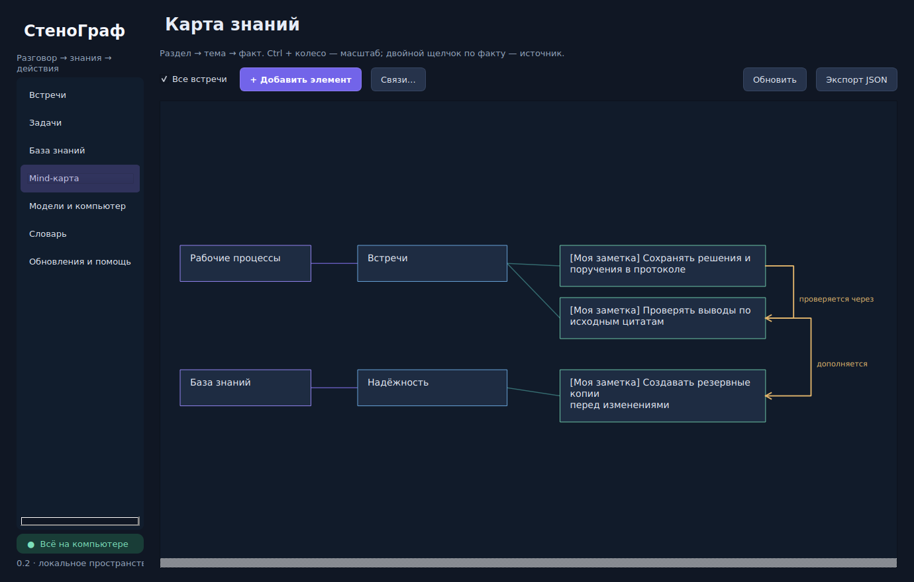

# СтеноГраф

Локальный диктофон и рабочее пространство для встреч на Windows: речь → протокол → задачи → база знаний.

**Версия 0.2.0.** Приложение Windows с локальными моделями. Новое: встроенный GGUF-движок, подробная помощь Ollama, обновление из GitHub, очистка аудио, редактируемые заметки и связи карты, удобные напоминания.



## Что реализовано

| Возможность | Поведение в 0.2 |
|---|---|
| Запись | Выбор микрофона и WASAPI loopback; независимые дорожки и шкалы уровня |
| Онлайн-встречи | Запись выбранного устройства воспроизведения одновременно с микрофоном |
| Распознавание | Локальный faster-whisper, фрагменты 3–30 секунд, VAD, CPU int8 / NVIDIA CUDA |
| Надёжность | Аудио сохраняется до обработки; очередь SQLite; повтор ошибок; восстановление WAV по служебным файлам |
| Протокол | Локальная Qwen3 через Ollama или Qwen2.5 GGUF внутри приложения: суть, решения, вопросы, темы, поручения и шаги инструкции |
| Доказательность | Для каждого вывода проверяется наличие дословной цитаты и существующей реплики |
| Задачи | Черновики из диалога, ручное создание/редактирование/удаление с подтверждением, исполнитель, срок, статус |
| Напоминания | Окно с контекстом, отложить на 15/60 минут, выполнить; пропущенные — после запуска |
| Mind-карта | Разделы/темы/факты, ручные заметки и направленные связи; редактирование и расширение |
| Поиск | SQLite FTS5: русские слова, префиксы, точные фразы, темы и подписи изображений |
| Инструкции | Шаги из диалога + скриншоты с подписями; экспорт в автономный HTML |
| Адаптация | История исправлений, словарь терминов, подсказки модели и явные правила замены |
| Подбор ПК | RAM, свободная память/диск, CPU, первая NVIDIA GPU/VRAM; предварительная рекомендация |
| Каталог | Модели и скрипты, назначение, источник, лицензия, оценка совместимости, статус интеграции |
| Экспорт/копии | HTML протокола и инструкции, JSON карты; скрипты резервного копирования и восстановления |

## Простая установка на Windows — без PowerShell

Откройте **НАЧАТЬ-ЗДЕСЬ.txt** в архиве. Всё основное запускается двойным щелчком.

1. Распакуйте архив целиком. Откройте папку, в которой лежит **Установить.cmd**. Не запускайте файлы прямо из ZIP.
2. Дважды щёлкните **Установить.cmd**. Дождитесь сообщения **ГОТОВО**. Нужен интернет для установки зависимостей; окно не закрывайте.
3. Дважды щёлкните **Подготовить-речь.cmd**. Дождитесь **ГОТОВО**: модель скачивается и выбирается автоматически.
4. Дважды щёлкните **Запустить.cmd**. Создайте встречу, выберите микрофон и нажмите **Записать**.

**Для протоколов и автоматического выделения задач:** отдельно установите [Ollama для Windows](https://ollama.com/download/windows), откройте его, закройте СтеноГраф через меню значка в трее и запустите **Подготовить-протоколы.cmd**. Этот файл скачает и выберет локальную модель с учётом памяти ПК. После подготовки снова откройте **Запустить.cmd**. Ollama должен работать во время создания протоколов.

**Python уже установлен:** установщик попробует использовать его сам. Поддерживается обычный CPython 3.11, 3.12 или 3.13 x64. Если подходящей версии нет, установите рядом Python 3.12 x64 с [python.org](https://www.python.org/downloads/windows/) и отметьте `Add python.exe to PATH`. Python 3.14+, 32-bit, ARM64 и free-threaded для этой сборки пока не поддерживаются. Удалять имеющийся Python не нужно.

**При ошибке установки:** окно останется открытым, подробности сохранятся в **install.log** рядом с `Установить.cmd`. Пришлите этот файл. Не удаляйте `.venv` вручную: новый установщик сохраняет непригодное окружение в `.venv-old-<дата>`, затем создаёт новое. Пользовательские встречи хранятся отдельно.

Для тех, кто предпочитает командную строку `cmd.exe`, достаточно:

```bat
cd /d "C:\Users\Hiro\Desktop\Stenograph"
Установить.cmd
```

При нестандартном расположении Python можно указать полный путь:

```bat
Установить.cmd --python "D:\Python312\python.exe"
```

Такой параметр требует, чтобы хотя бы один Python был доступен для запуска установщика. Альтернатива — запустить его напрямую: `"D:\Python312\python.exe" scripts\install.py --python "D:\Python312\python.exe"`.

Старый `scripts/Install-Windows.ps1` исправлен для нескольких launcher-путей, но для обычной установки используйте **Установить.cmd**. Запуск от администратора и изменение политики PowerShell для нового пути установки не требуются.

## Работа полностью без интернета

После подготовки пакетов и моделей работа с данными не требует интернета. Десктоп не содержит облачного клиента распознавания, не выполняет загрузки моделей и не отправляет телеметрию. Проверка обновлений обращается к GitHub только по вашей команде. Включены `HF_HUB_OFFLINE=1` и `TRANSFORMERS_OFFLINE=1`. Модель речи загружается только из локальной папки с `local_files_only=True`.

В режиме Ollama клиент протоколов обращается только к `http://127.0.0.1:11434`; системные HTTP-прокси и переадресации отключены. Допускаются только перечисленные локальные Qwen3-теги. **Ollama — отдельная программа:** её автообновления и сетевые настройки регулируются отдельно. Для гарантированно изолированной среды используйте отключённую сеть и заранее установленные локальные веса; не выбирайте облачные модели.

Для отключения облачных функций Ollama задайте `OLLAMA_NO_CLOUD=1` в окружении **процесса Ollama** и перезапустите его. Это официальная настройка Ollama, она не заменяет отключение сети для полной изоляции. Если Ollama запускается из трея, настройте переменную в Windows перед его повторным запуском.

Для полностью изолированного ПК подготовьте зависимости на другом **Windows x64 с Python 3.12**:

```powershell
py -3.12 -m pip wheel . --wheel-dir wheelhouse
```

Перенесите `wheelhouse`, папку модели речи, установщик Python, установщик Ollama и каталог локальных моделей Ollama. На целевом ПК:

```powershell
py -3.12 -m venv .venv
.\.venv\Scripts\python.exe -m pip install --no-index --find-links wheelhouse stenograph-local
```

Затем запускайте `Start-Stenograph.cmd`. Для Ollama сохраните структуру `blobs` и `manifests`; расположение хранилища определяется `OLLAMA_MODELS` либо настройками установленного Ollama. Сначала проверьте `ollama list` при отключённой сети.

## Запись онлайн-встреч

- В поле «Звук встречи» выберите loopback именно того устройства, через которое слышите собеседников: динамики, USB-гарнитура или другое устройство.
- Микрофон сохраняется отдельно от системного звука. Используйте наушники, чтобы речь собеседников повторно не попадала в микрофон; подавление эха пока не реализовано.
- Переключение устройств/гарнитур во время записи требует остановки и повторного выбора. При отключении устройства приложение сообщает об ошибке и останавливает запись.
- Loopback записывает весь звук выбранного устройства, включая другие приложения. Избирательный захват одного процесса пока не реализован.
- «Онлайн» здесь означает обновление расшифровки **во время разговора**. Задержка: длина фрагмента + время распознавания + очередь. Это не пословная трансляция с гарантированной задержкой.
- Текстовые импорты не имеют реальных таймкодов; интерфейс показывает для них прочерк.

## Оптимизация и память

Сначала попробуйте `base`, CPU/int8, 10 секунд и половину потоков CPU. Встроенная рекомендация оценивает доступные ресурсы; она **не гарантирует** скорость и совместимость драйверов. AMD/Intel GPU пока не используются faster-whisper; CPU работает независимо от производителя GPU.

Для CUDA нужны совместимые NVIDIA библиотеки, описанные в [документации faster-whisper](https://github.com/SYSTRAN/faster-whisper#gpu). Наличие NVIDIA в отчёте ещё не доказывает готовность CUDA/cuDNN. CPU выбран по умолчанию.

```powershell
.\.venv\Scripts\python.exe scripts\benchmark.py --model models\faster-whisper-base --audio sample.wav
```

RTF — время вычисления / длительность аудио. Для одного источника нужен RTF < 1, для двух — сумма RTF < 1; желателен запас 30%. При отставании очередь остаётся на диске и обрабатывается позднее. UI показывает длину очереди. Самая большая модель может быть медленнее реального времени.

Модель речи загружается один раз на сеанс распознавания. Перед протоколом она освобождается; Ollama вызывается с `keep_alive=0`. Длинные диалоги анализируются целиком по частям, затем результаты объединяются. Разделы с одинаковым написанием объединяются между встречами; семантическое слияние синонимов пока не реализовано.

Аудио хранится в PCM WAV без сжатия: 48 kHz / 16 bit / mono ≈ 346 МБ в час на источник; stereo ≈ 691 МБ. Обработанное аудио удаляется через час после успешного сохранения протокола. Проверка раз в минуту и после запуска; активная запись защищена. Текст, протоколы и скриншоты сохраняются. Нераспознанное аудио и старые записи 0.1 без нового протокола не удаляются. Нужный оригинал заранее скопируйте в другую папку. При свободном месте ниже 250 МБ запись останавливается.

## «Самообучение» в этой версии

Двойной щелчок по реплике сохраняет исправленный текст и историю изменений. Оригинал остаётся в базе. В словаре можно добавить правило «ошибочное написание → правильное»; новые распознавания используют правильные термины как подсказки и применяют правила замен.

Это адаптация к вашей лексике. Автоматическое изменение весов, LoRA, обучение на каждой встрече и неподтверждённое автоисправление всей истории **не реализованы**. Для дообучения нужен отдельный набор подтверждённых примеров и контроль качества на отложенных данных.

## Где данные и как восстановить

По умолчанию: `%LOCALAPPDATA%\Stenograph` — `knowledge.sqlite3`, `audio`, `screenshots`, `settings.json`. Для другой папки задайте `STENOGRAPH_DATA_DIR` перед запуском. Данные не шифруются самим приложением; для шифрования диска можно использовать возможности Windows.

Закройте приложение через меню трея, затем:

```powershell
.\.venv\Scripts\python.exe scripts\backup.py --output D:\Backups\stenograph.zip
.\.venv\Scripts\python.exe scripts\restore.py --archive D:\Backups\stenograph.zip --destination D:\StenographRestored
$env:STENOGRAPH_DATA_DIR = 'D:\StenographRestored'
.\.venv\Scripts\python.exe -m stenograph
```

Восстановление допускается только в пустую папку. Пути вложений переназначаются. Модели не включаются в резервную копию; папку модели после восстановления нужно выбрать заново.

## Разработка и сборка

```powershell
python -m pip install -e '.[dev]'
python -m pytest -q
python -m ruff check .
python -m PyInstaller --noconfirm Stenograph.spec
```

Сборка запускается **на Windows**, результат — каталог `dist\Stenograph`. Модели и Ollama поставляются отдельно. `.github/workflows/windows.yml` содержит тестирование и сборку артефакта на Windows; это подготовленный сценарий, а не подтверждение успешно собранного EXE. Для распространения потребуются лицензионные уведомления зависимостей и проверка состава сборки (включая Qt/PySide6).

Документы: [архитектура и развитие](docs/ARCHITECTURE.md), [приёмка и ограничения](docs/VALIDATION.md), [источники компонентов](docs/SOURCES.md).

## Репозиторий и обновления

[GitHub: hiromoto27/Stenograph](https://github.com/hiromoto27/Stenograph). Для первого перехода с 0.1 распакуйте 0.2 в новую папку, выполните **Установить.cmd**, затем **Запустить.cmd**. Папка данных в профиле Windows сохранится; повторно скачивать модели не нужно, если их прежняя папка остаётся на диске.

Следующие версии: **Обновления и помощь → Проверить обновления → Установить обновление**. Альтернатива — **Обновить.cmd**. Требуется выпуск с большим номером и `release.json` в выбранной ветке. Обновляются программные файлы из проверенного коммита и зависимости Python; встречи и модели не входят в список обновления. Предыдущие исходники сохраняются в `update-backups` внутри папки данных. Изменённые вручную исходники блокируют обновление. При ошибке зависимостей исходники восстанавливаются, но пакеты могут потребовать повторного запуска установщика. Для EXE нужно скачать новую сборку отдельно.

## Подробная помощь и встроенные нейросети

Откройте **[инструкцию по Ollama, встроенным моделям и новым функциям](stenograph/resources/help.html)** в браузере или раздел «Обновления и помощь» в приложении. Инструкция содержит последовательность действий и разбор типовых ошибок.

Чтобы создавать протоколы без отдельной Ollama, закройте приложение и дважды щёлкните **Подготовить-встроенную-модель.cmd**. После однократной загрузки пакета и Qwen2.5 1.5B GGUF (~1.12 ГБ) всё работает в процессе СтеноГрафа. CPU-пакет устанавливается только готовым wheel, без компиляции; его доступность зависит от Python/Windows. При отсутствии пакета остаётся рабочий вариант с Ollama. Компактная модель может уступать крупным по качеству; проверяйте протокол по цитатам.

Ручные элементы карты редактируются двойным щелчком. Можно менять раздел/тему, достраивать связанными заметками и управлять направленными связями через «Связи…». Можно сменить оба конца связи и подпись, удалить связь отдельно от элементов. Ручные знания и связи сохраняются при повторном анализе; автоматические факты остаются привязаны к расшифровке. JSON-экспорт включает ручные элементы и связи.

## Подготовка нового выпуска разработчиком

Измените версию в `pyproject.toml` и `stenograph/__init__.py`, выполните тесты, добавьте файлы в Git и запустите `python scripts/make_release.py`. Добавьте обновлённый `release.json` в тот же коммит. Манифест содержит контрольные суммы программных файлов; не включайте модели и личные данные. Для контролируемого обновления используйте защищённую ветку и проверку изменений перед слиянием.
